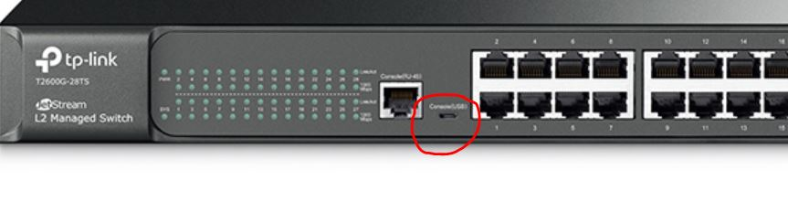
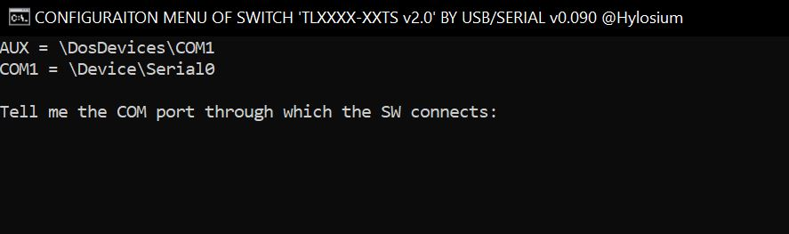
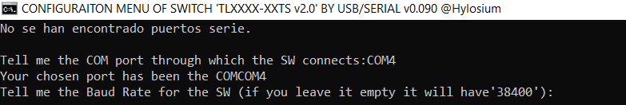
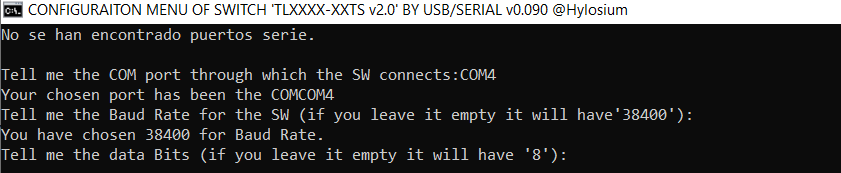
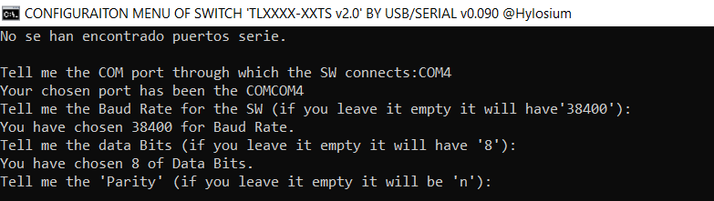
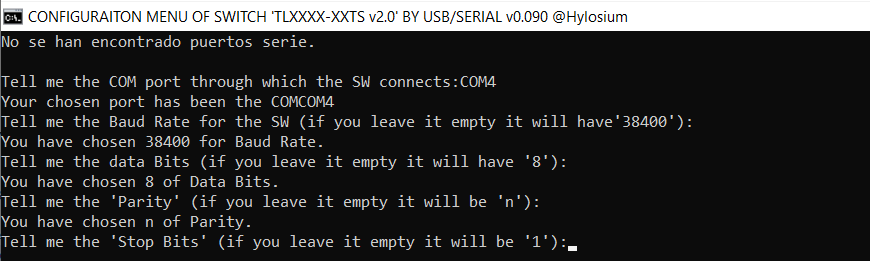
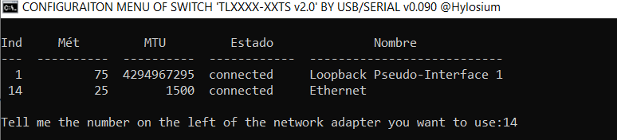
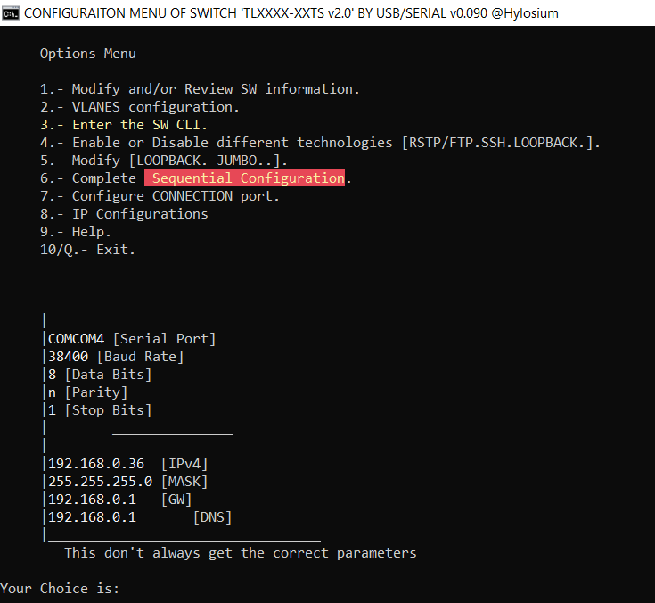

# tplink-sw_config
 This is an interactive menu made for Windows 10 and can be used to acces and config a TP-LINK SW by USB cable, edit and save configurations without accesing the admin page all via batch file.  
 Program is avaidable in Spanish (my native langage) and English and working greatly in both versions for TP-LINK Switchs TL2600G-28TS,TL2600G-52TS in v1.0 and v2.0 tested.
 
 This works by making ".txt" files with batch and sending it to the SWITCH with plink (plink uses telnet so this is not encrypted)

## Models Tested

    Switches: TL2600G-28TS, TP-LINK T2600G-52TS
	
(if you have tested other devices and works greatly please let me know, I will update the readme)

## Steps
The steps to acces to a TP-LINK SW with MENU_CONF.BAT are:

1. Connecting your TP-LINK by USB to the PC where you have the program.
When you execute the program it will ask you the Com_Port, the Baud Rate,

    

2. Execute it, it will promt you to a question from where you have to choose what port COM (will show you all COM ports avaidable, select yours) is your SW connected, like this:
(for example, in my case it would be COM4, but I don't have the SW connected right know so it will not be avaidable)

    

3. It will ask you for the Baud Rate you want to use to connect to your SW, if you leave it blank it will be '34800'.

    

4. Will ask you for the value of Data Bits you want to use to connect to your SW, if you leave it blank it will be '8'.

    

5. Will ask you for the value of Parity you want to use to connect to your SW, if you leave it blank it will be 'n'.

    

6. Will ask you for the value of Stop Bits you want to use to connect to your SW, if you leave it blank it will be '1'.

    

7. Now it wil promt you the net adapters you have connected to your machine, select yours  by insterting the number on the left (for example, in my case in 14)

    

8. Know you are on the interactive menu where you can choose what options to use for the SW.

    

9. All the info about what command does this or that it in the 9 Option of the interactive menu. 😄
💖 from 🇪🇸

## Dependencies

* [Plink](https://www.chiark.greenend.org.uk/~sgtatham/putty/latest.html) - command-line back ends to PuTTy

## F.A.Q
1. ¿Does it work with Linux?
R. I don't think so, script was made for Windows 10, I hope you can make it work with a W10 Virtual Machine
2. Why is showing me other IP configuration if I have selected other?
R. This only happen if you have 2 or more IP configuration in the same adapter, you have selected corretly, and if you do change the IP configuration from the menu it will change but its shows other configuration because it takes the value of the first IP it sees, for example, if you have two IP configuration for one adapter it will take the first.
